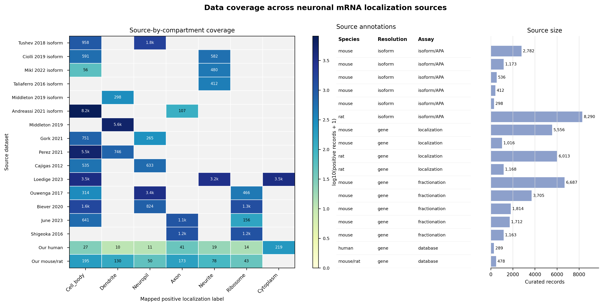
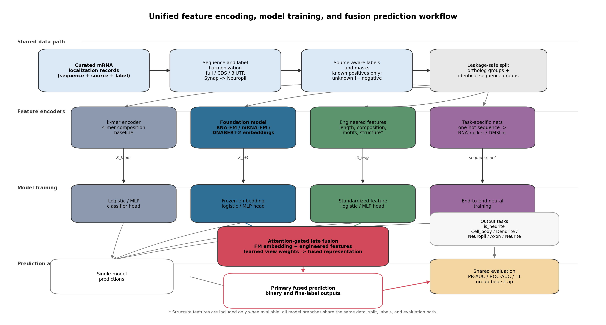
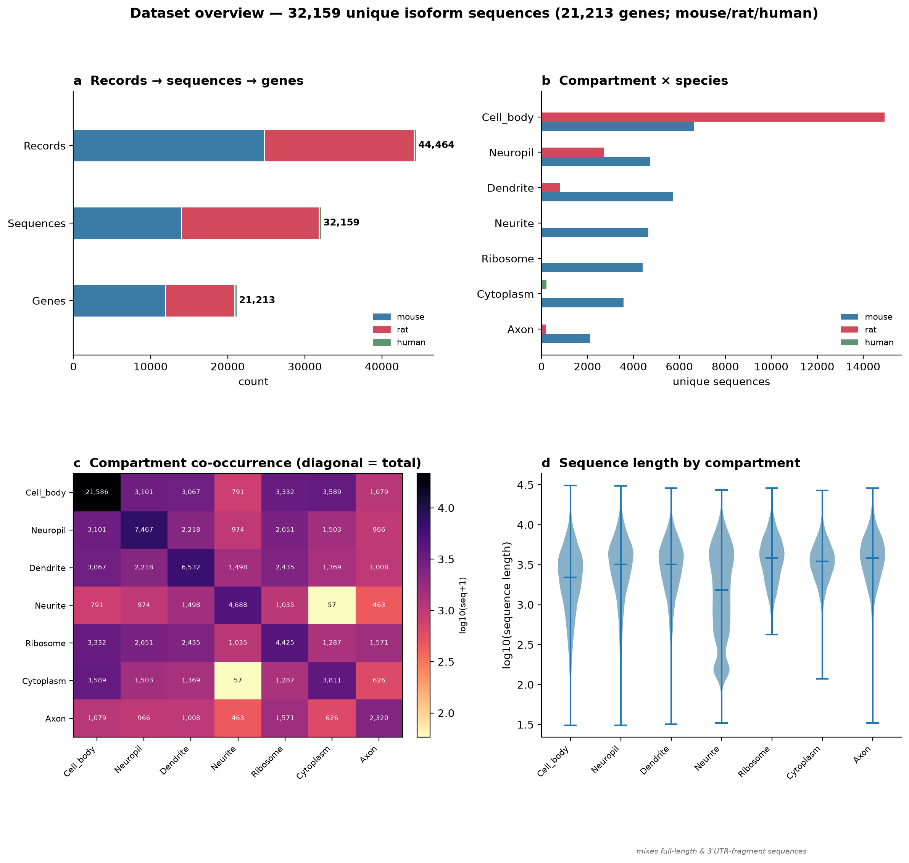

# 泄漏安全评估下序列基础模型不优于 k-mer：注意力门控融合是神经元 mRNA soma–neurite 定位的稳健最优预测器

> 本文为整合后的完整论文稿（中文，目标期刊：Nature Communications；按 nature-writing 证据阶梯
> 组织、负结果主线）。科学问题：**为神经元 mRNA 的 soma–neurite 亚细胞定位训练一个由序列预测的模型**，并建立
> 可复现、泄漏安全的评估标准。我们以此为目标构建基准、系统比较候选模型族，据此提出并验证一个
> 最优预测器。所有数字为 test 集 + 按基因/同源组聚类自助法（2000 次重采样），ROC-AUC 与 AUPRC
> 双度量（完整结果 `results/bootstrap_all.csv`）。物种：mouse + rat + human（全物种）。
>
> **标题候选**（最可辩护者标 ★）：
> 1. ★（finding-led）泄漏安全评估下序列基础模型不优于 k-mer：注意力门控融合是神经元 mRNA
>    soma–neurite 定位的稳健最优预测器。
> 2.（system-led）一个注意力门控融合模型用于神经元 mRNA soma–neurite 定位：在泄漏安全基准上稳健
>    超过 k-mer、基础模型与任务专用网络。
> 3.（mechanism-led）与转录本长度无关的基础模型表示驱动神经元 mRNA 定位预测的增益。
> *（候选 1 直陈负结果钩子且每一分句均由表1–3 支撑，最稳。）*

---

## 摘要（Abstract）

**目标** 神经元将特定 mRNA 运输到神经突（树突/轴突）并局部翻译；这种 soma–neurite 定位被认为
在很大程度上由转录本序列编码。我们的目标是**训练一个由序列预测该定位的模型**，并建立可复现的
评估标准。**方法** 我们构建一个泄漏安全、多来源的神经元 mRNA soma-vs-neurite 定位基准（据我们
所知是该任务上首个按同源组分组、跨区域/分辨率的统一泄漏安全基准；18 个数据集，含 6 个 isoform
分辨率来源），在统一的按基因/同源组/相同序列分组的冻结划分下，跨转录本
区域（3'UTR、CDS、全长）×分辨率（基因、isoform）系统比较 k-mer、两种任务专用深度网络
（RNATracker/DM3Loc 式）与四个 RNA/DNA 基础模型（RNA-FM、mRNA-FM、UTR-BERT、DNABERT-2）的
冻结嵌入。**结果** 在泄漏安全评估下，**没有任何单一模型可靠地超过简单 k-mer 基线**——基础模型
（ΔROC-AUC 最优情形仅 +0.018，p=0.032，不抗多重比较；AUPRC 下 0/5）与深度网络（无截断评估后均
≤ k-mer）皆然。据此我们提出一个**注意力门控融合模型**，将一个序列基础模型嵌入与可解释序列特征
融合：它在**全部五个设置**下均为最优，**显著且抗 Bonferroni 地超过 k-mer、全部单一模型与两个
深度网络**（vs k-mer ΔROC +0.024~+0.056、vs 网络 +0.030~+0.109，ROC 与 AUPRC 一致），在全长×
isoform 上达 ROC-AUC 0.750。成分分解表明增益主要来自**基础模型表示在可解释特征之上的增量、且与
转录本长度无关**（全长 +0.085、isoform 3'UTR +0.029，均 p<0.001）。匹配基因的区域消融显示
**定位信号在全长转录本上最强**（全长 vs 3'UTR +0.042，p=0.001）。在 5 隔室多标签任务上结论一致，
该融合模型同为最优。**意义** 我们交付一个跨区域/分辨率稳健的神经元 mRNA 定位预测器，并指出
**融合互补的序列视图**是该任务上比任何单一模型（包括大型基础模型）更可靠的方向；同时开放基准、
泄漏安全划分与模型。

---

## 1 引言（Introduction）

神经元是高度极化的细胞，其树突与轴突（统称神经突，neurite）中的局部翻译对突触可塑性、轴突导向
与记忆形成至关重要。实现局部翻译的前提，是特定 mRNA 被定向运输并锚定到神经突，而非滞留于胞体
（soma）。经典工作表明，这种亚细胞定位在很大程度上由转录本序列编码——尤其是 3'UTR 上的“邮政
编码”（zipcode）元件与 RNA 结合蛋白结合位点。

**本文的科学目标是：训练一个由转录本序列预测神经元 mRNA soma–neurite 定位的模型，并建立可复现、
泄漏安全的评估标准。** 为达成这一目标，我们需要回答：哪类序列表示最能预测定位？现成的 RNA/DNA
基础模型、任务专用深度网络、还是简单的 k-mer 统计？它们能否被有效组合？

**相关工作。** 序列预测 mRNA 亚细胞定位已有三条技术路线，但均未直接回答上述问题。
*(i) 序列特征与任务专用深度网络。* 早期方法以 k-mer/理化特征加经典分类器为主——iLoc-mRNA 以
k-mer + ANOVA 特征选择 + SVM、mRNALoc 以机器学习特征、SubLocEP 以理化特征的双层加权预测定位
[ref: Zhang 等 iLoc-mRNA；Garg 等 mRNALoc；Li 等 SubLocEP]；RNATracker 与 DM3Loc 则用
RNN/CNN+注意力从 one-hot 序列端到端学习 [ref: Yan 等 RNATracker；DM3Loc]。这些工作多在通用细胞系
隔室（核/质等）上评估，**很少在按同源组分组的泄漏安全划分下、与强 k-mer 基线做公平比较**。
*(ii) RNA/DNA 基础模型。* RNA-FM、mRNA-FM、UTR-BERT、DNABERT-2、RNAErnie 等在大规模序列上预训练，
被认为能捕获可迁移的序列语法 [ref: RNA-FM；DNABERT-2；RNAErnie]；但**其冻结嵌入是否在该定位任务
上真正优于简单基线，尚缺泄漏安全的系统验证**。
*(iii) 多视图 / 多标签融合与类别不平衡。* 最近的 mRSubLoc 将 RNA 大模型 RNAErnie 与 one-hot、
Word2Vec 多视图经 TextCNN+BiLSTM+多头自注意力融合做多标签 mRNA 定位 [Wang 等, IEEE JBHI 2025]；
mRNALocator-imb 将理化模式特征与分布式核酸表示用 RandomForest+GRU 集成、以 LDAM 损失与 ADASYN
专门处理类别不平衡 [Hu 等, IET Syst Biol]；iLoc-lncRNA-BERT 则以 BERT 做人类 **lncRNA**（非 mRNA）
的多标签定位、并报告跨物种迁移性能下降（human→mouse）与测试集 micro-AUROC ≈0.70 [Zhang 等, Int J
Biol Macromol 2024]。这些工作共同证明了多视图融合、多标签建模与不平衡处理的价值，也印证该类任务
的固有难度（测试 AUROC 常在 0.70 量级）；但它们**针对的是通用细胞系隔室（核/质等）、而非神经元
soma–neurite 定位，且未在按同源组的泄漏安全协议下、对强 k-mer 基线隔离“融合相对单一视图的净增益”
及其与转录本长度的关系**。本文在神经元 soma–neurite 任务上、于统一泄漏安全协议下正面回答这三处
空白；我们同样面对严重类别不平衡（如 Axon 基率 ~0.07），并以 `pos_weight` 加权与 AUPRC 双度量
而非重采样来应对。

围绕这一目标，本文贡献：
1. **泄漏安全、多来源的神经元 mRNA soma-vs-neurite 定位基准**（mouse/rat/human，18 数据集，含
   6 个 isoform 来源），在统一冻结划分下跨区域×分辨率系统比较各序列模型族。
2. **基准发现：在泄漏安全评估下没有单一模型可靠超过 k-mer**——这为模型设计提供了明确动机：
   不能依赖任一单一表示。
3. **提出的定位模型——注意力门控融合**：融合一个基础模型嵌入与可解释序列特征，在所有区域/
   分辨率下均为最优且显著超过所有对照；成分分解证明增益主要来自模型表示、与长度无关。
4. **生物学发现：定位信号在全长转录本上最强**，提示信号分布于整条转录本而非局限 3'UTR。

---

## 2 方法（Methods）

### 2.1 数据集与样本规模
汇总 18 个公开神经元 mRNA 定位数据集（mouse、rat、human）。视设置（区域 × 分辨率 × 任务）不同，
经标签规整、来源掩码与泄漏安全划分后的样本数与冻结划分如下（表0）。human 样本极少（二分类各设置
仅 83–92、多标签 289），主体为啮齿类；human 保留在全物种数据中，但不单独评估。

**表0. 各设置样本规模与冻结划分（train / val / test；test 物种构成）**

| 设置 | N | train | val | test | test: mouse / rat / human |
|---|---:|---:|---:|---:|---|
| 3'UTR · gene | 19,108 | 13,380 | 2,873 | 2,855 | 1,689 / 1,159 / 7 |
| 3'UTR · isoform | 29,921 | 20,841 | 4,591 | 4,489 | 2,332 / 2,150 / 7 |
| CDS · gene | 16,768 | 11,728 | 2,518 | 2,522 | 1,573 / 933 / 16 |
| 全长 · gene | 20,143 | 14,094 | 3,030 | 3,019 | 1,843 / 1,165 / 11 |
| 全长 · isoform | 32,021 | 22,559 | 4,721 | 4,741 | 2,570 / 2,160 / 11 |
| fine 全长 · gene | 20,347 | 14,265 | 3,032 | 3,050 | 1,807 / 1,187 / 56 |
| fine 全长 · isoform | 32,229 | 22,554 | 4,808 | 4,867 | 2,566 / 2,245 / 56 |
| 区域消融（共同 test） | — | — | — | 2,514 | 1,580 / 917 / 17 |

多标签（fine）设置的 N 略大于对应二分类（如全长 gene 20,347 vs 20,143；human 289 vs 92），因为
二分类额外施加了一道负例可靠性过滤（见 2.3），而多标签只要某隔室有可观测标签即保留。

**图0. 神经元 mRNA 定位数据的来源构成。** 左：18 个来源 ×（隔室标签）的覆盖矩阵（格内为该来源-隔室
的策展记录数，颜色为 log10(记录数+1)），显示绝大多数来源只贡献少数隔室、且不同隔室由不同来源主导
——这是我们按来源掩码标签、并对单源主导隔室（如 Neuropil←Ouwenga）保持谨慎的依据。中：各来源的
物种 / 分辨率 / assay 注释。右：各来源的策展记录规模。

### 2.2 标签处理
**任务一为二分类 soma vs neurite**；**任务二为 5 隔室多标签**。

- **隔室词表与映射（跨物种统一）**：将各来源的 location 字符串规范化后映射到固定隔室。
  Cell_body → soma；Dendrite / Neuropil / Axon / Neurite → neurite。**Synap（突触）按其
  synaptoneurosome 生化定义并入 Neuropil**（synaptoneurosome 是突触前末梢 + 附着突触后/树突成分的
  生化组分，属神经突区）。**Ribosome / Cytoplasm 属翻译/分馏轴**（核糖体占据、核质分馏），与解剖
  隔室正交，从定位任务剔除。
- **来源可观测性掩码（source mask）**：每来源真实测定的隔室集合 `src_measured[source]` 由**原始
  记录按来源分组统计**得到（非从合并后的标签反推）。某（合并）样本对隔室 c 的“可观测” =
  其任一来源测过 c；仅在“可观测但未阳性”时记为阴性，避免把“未测”当“非定位”，也避免 isoform
  序列合并时把某来源的隔室“传染”给未测该隔室的来源。
- **二分类标签聚合（soft）**：对测过 soma 或 neurite 的来源计 `neurite_frac` = 命中 neurite 的来源数
  /（命中 neurite + 命中 soma 的来源数）；目标 `y = 1[neurite_frac ≥ 0.5]`，**逐样本置信度权重
  `w = |2·neurite_frac − 1|`**（一致来源给高权重，矛盾来源给低权重，下限 1e-3）。`neurite_frac`
  为 NaN（无 soma/neurite 证据）的样本剔除；另剔除“纯 soma 且无任何同时测过 soma+neurite 的来源
  支撑”的不可靠负例。
- **多标签标签（fine）**：5 个隔室各为一个二元目标，配**逐标签掩码**（仅在该来源测过该隔室时计入）
  与逐标签软置信度权重；隔室须达最小支持度（fine 200、二分类 150）方纳入。**这是真正的多标签**
  （每样本一个 5 维目标向量 + 5 维掩码），用带掩码的损失训练，不是 5 个独立单标签问题。

### 2.3 样本构建与区域、序列长度处理
- **粒度**：基因级（每 species-gene 取代表序列，transcript_is_canonical 优先、否则最长）；isoform 级
  （多数 isoform 来源无 transcript_id，以**相同序列**为异构体标识，完全相同序列合并并并集标签）。
- **区域规整**（`apply_region`，依 `sequence_type` 路由）：显式全长（cdna/transcript/mrna）的行用
  Ensembl GTF（GRCh38/GRCm39/GRCr8）提取 3'UTR（取末尾 l3 nt）/ CDS（去首 l5、尾 l3）；已是目标
  区域的行（原生 isoform 3'UTR、ALE 区间）原样通过；空 `sequence_type` 默认按全长提取，可用
  `--native-region-sources` 标注原生区域来源。CDS 提取**要求 5'UTR 与 3'UTR 均有标注**，任一缺失或
  坐标非法即跳过（保守：宁丢不错，保证喂入序列确为目标区域）。
- **序列长度**：序列可长达 **31,189 nt**；提取后 3'UTR 与全长的长度 p95≈5.0–5.1 kb、p99≈8.5 kb、
  最长 ~30 kb（旧的固定截断会切掉相当比例的远端，见下）。
- **长序列处理（各模型对齐为"看完整序列"）**：
  - **k-mer / 工程特征**：在全长序列上统计，天然无长度上限。
  - **基础模型与 fusion**：按窗口长度 = `max_tokens × nt_per_token` 对序列**滑窗**（`for start in
    range(0, len(s), win_nt)`，无窗口数上限，覆盖整条），各窗口 token 均值池化、再窗口间均值聚合；
    DNABERT-2 的 BPE 在窗口内 token 数恒 ≤ 窗口核苷酸数，窗口不溢出。**均不截断。**
  - **任务专用网络**：唯一以固定长度 one-hot 输入者。为消除截断且不改架构（两网络均为长度无关的
    全局池化），采用**变长 one-hot + 长度分桶动态 padding + padding 掩码**：按长度排序、在 token
    预算内成批、每批仅 pad 到该批最长；真实有效长度穿过卷积/池化换算后构造掩码，使注意力/池化屏蔽
    补零。统一 `--ts-max-len 31000`（覆盖全部样本）→ **全 benchmark 无截断**。（旧固定阈值下
    3'UTR ~31%、CDS ~8% 的样本被从 5' 端截断、恰好丢失远端 3'UTR；截断会**高估**这些网络。）

### 2.4 泄漏安全划分
将样本按**基因、同源组（ortholog group）、相同序列（精确 SHA-256 哈希 + union-find 传递闭包）**
合并为不可拆分的分组单元；在**分组层面**做 70/15/15 平衡划分，以 best-of-N（多次随机划分取评分最优）
兼顾各标签在 train/val/test 的支持度与比例，**一次冻结、该设置所有模型复用**（`--split-assignments`）。
二分类与多标签因有效样本集不同（见 2.1/2.2），各自在其 universe 上生成独立的泄漏安全冻结划分。
区域消融用最严格的 CDS 基因交集作公共基因集（CDS ⊆ 3'UTR ⊆ 全长）+ `--restrict-to-split`，使三区域
在**同一批基因、同一划分**上比较，唯一变量为区域。

### 2.5 输入表示与模型架构
所有模型共用同一数据/划分/标签/目标/评估，**唯一差异为编码器**（图M）：

**图M. 注意力门控融合架构。** 两个互补视图（区域适配的基础模型嵌入与可解释工程特征）各自投影至 128 维
共同空间，由一个输入相关的门控跨视图 softmax 加权融合，再经 MLP 头输出各隔室概率。所有 StandardScaler
仅在 train 上拟合以防泄漏。

- **k-mer 基线**：归一化重叠 4-mer 频率（256 维）→ 逻辑回归（`class_weight=balanced`，L2，
  逐样本权重）。
- **RNATracker 式网络**（one-hot，4×L）：两层 `Conv1d(k=10, pad=5)`（4→32→32）各接 ReLU、
  Dropout 0.2、`MaxPool1d(3)`；双向 LSTM（hidden 32，双向→64）；**加性注意力池化**（按真实长度
  掩码）；MLP 头 `Linear(64→64)→ReLU→Dropout 0.3→Linear(64→nC)`。从零训练。
- **DM3Loc 式网络**（one-hot）：`Conv1d(4→64, k=7, pad=3)→ReLU→MaxPool1d(4)`；**多头自注意力**
  （d=64，4 头，dropout 0.1，`key_padding_mask` 屏蔽补零）+ LayerNorm 残差；加性注意力池化；同款
  MLP 头。从零训练。
- **基础模型冻结嵌入 + 头**：UTR-BERT（3-mer）、RNA-FM（核苷酸，hidden 640）、mRNA-FM（codon，仅
  CDS）、DNABERT-2（BPE，ALiBi）。冻结编码器，滑窗（见 2.3）取 token 均值（排除特殊 token）得到
  转录本嵌入 → StandardScaler → 每标签逻辑回归头。
- **端到端微调**：另对 RNA-FM 做整模型 + 线性头微调（含 truncate / sliding_mean / pooled_repr 长
  序列策略）作对照。
- **提出的融合模型（fusion）**：两个视图——(i) 一个区域适配的基础模型嵌入（全长/3'UTR 用 RNA-FM、
  CDS 用 mRNA-FM），(ii) 工程特征向量；各视图先 `Linear(d_i→128)→ReLU→LayerNorm` 投影至 128 维
  共同空间，一个**输入相关的门控** `Linear(128→1)` 对各视图打分、跨视图 softmax 得权重，**融合向量
  = Σ_i w_i·h_i**；再经 MLP 头 `LayerNorm→Dropout 0.3→Linear(128→128)→ReLU→Dropout 0.3→
  Linear(128→nC)`。各视图的 StandardScaler 仅在 train 上拟合（防泄漏）。优化器 AdamW（lr 1e-3、
  weight decay 1e-4），batch 64，验证 macro-AUC 早停（patience 8）。门控让模型按转录本自适应决定
  信赖学习表示还是可解释特征。

### 2.6 工程特征（可解释视图）
长度与 log 长度；GC 含量；16 维二核苷酸组成；一组定位相关 motif 密度（AU-rich AUUUA、CPE UUUUAU、
poly-U、GU-rich、G-quadruplex 代理 GGG、poly(A) 信号 AAUAAA，按每 kb 归一化）；二级结构 MFE 为
可选（ViennaRNA）。**长度是已知混淆变量**，故另设“仅长度”基线量化其贡献，并在成分分解中将其
单列。

### 2.7 训练目标（损失函数）
统一采用**带掩码的二元交叉熵**（`binary_cross_entropy_with_logits`，多标签即对 5 个隔室分别计算）：
- **`pos_weight`** 平衡正负，按 train 上各标签 neg/pos 比裁剪到 [0.2, 5.0]；
- **逐样本软置信度权重** `w`（来自标签聚合，见 2.2）；
- **逐标签可观测性掩码** `m`（未测标签不计入损失）；
- 有效损失 = `Σ(BCE · m · w) / Σ(m · w)`。

深度网络与微调用 AdamW、验证集 macro-AUC 早停；逻辑回归头用带类别权重的 L2 逻辑回归。**阈值在验证集
上选取**（F1 最优），测试集阈值不二次调整。

### 2.8 评估与统计
**模型选择仅用验证集**（阈值无关的 macro-ROC/PR 为选择标准）；测试集指标仅汇报一次。主指标**同时
报告 ROC-AUC 与 AUPRC**：ROC-AUC 与类先验无关、便于跨设置比较；AUPRC 对不平衡正类更敏感（尤其
多标签低基率隔室，如 Axon 基率 ~0.07）。所有模型间差异用**按基因/同源组的聚类自助法（2000 次
重采样，按分组单元重采样而非单样本，尊重泄漏安全分组）**给出 95% CI 与双侧 p，**两个度量分别
检验**；对“提出模型 vs k-mer”的多项比较施加 Bonferroni 校正。成分分解通过“仅长度 / 工程特征 /
仅基础模型 / 融合”四组对照 + 两两自助法完成（二分类与多标签分别做）。所有主结论在 ROC-AUC 与
AUPRC 下一致（完整结果 `results/bootstrap_all.csv`）。

### 2.9 部署模型
最优配置（全长 fusion）以 `--train-on-all` 在全部样本上重拟合，保存 `fusion_model.joblib`（融合
网络权重 + 每视图 StandardScaler + 类别/特征顺序），由 `predict.py` 对新序列复现预处理（区域路由、
滑窗嵌入、工程特征）并打分。报告指标取 benchmark 的 held-out 数，而非该 in-sample 拟合数。

---

## 3 结果（Results）

> 主任务为 **5 隔室多标签（fine）**：Cell body、Dendrite、Neuropil、Axon、Neurite。主指标为
> **macro-AUPRC 与 macro-AUROC 双度量**；阈值仅在验证集选取、应用于测试集；模型间对比用按
> 基因/同源组聚类的分组自助法（2000 次重采样、95% CI、抗 Bonferroni），模型选择仅用验证集。
> 设置（区域 × 粒度）= {3'UTR×gene, CDS×gene, 全长×gene, 全长×isoform}，**主 benchmark = 全长×isoform**。
> 下文 `[ ]` 为待 `scripts/make_fine_report.py` 跑出后回填的数值（表格同）。

### 3.1 构建来源感知、泄漏安全的神经元 mRNA 定位 benchmark
我们整合 **17 个已发表神经元 mRNA 定位与局部翻译数据来源**（18 个数据文件；June 的两个文件合并计为
一个来源、Middleton 的 gene 与 isoform 计为两个来源），覆盖 mouse、rat、human 三个物种，统一为多标签
soft 标签并附**来源可观测性掩码**（未观测 ≠ 阴性），按基因、同源组与完全相同序列的传递闭包合并为
泄漏安全单元，70/15/15 冻结划分。原始 [44,464] 条记录去重后得 [32,159] 条唯一 isoform 序列、
[21,213] 个唯一 (物种, 基因)；isoform 级物种构成为 rat [17,899] / mouse [13,971] / human [289]。

细粒度任务保留 **Cell body、Dendrite、Neuropil、Axon、Neurite 五个解剖隔室**；Ribosome 与 Cytoplasm 为
**测定轴标签**（Ribo-seq、生化分级），非解剖隔室，故排除于 fine 任务之外。各隔室在训练集中的可观测
阳性支持度 n_c⁺ 见表 1；经传递闭包分组后，训练/验证/测试集之间不存在共享分组单元，三集的标签支持度
与物种构成保持总体可比。

**图1. 数据集概览（均在唯一 isoform 序列水平计数）。** (a) 记录 → 唯一序列 → 唯一基因的策展漏斗，按
物种分色；(b) 各隔室 × 物种的样本数；(c) 隔室共现矩阵（对角线为各隔室总数）；(d) 各隔室序列长度分布。
来源 × 隔室覆盖矩阵见 `source_coverage_matrix`、隔室共现 UpSet 见 `fig_compartment_upset`。各隔室证据
来源高度不均衡、测量范围不一致，故训练与评估仅在来源可观测的样本–标签组合上进行。

**本节回答：数据是否可靠、标签是否确有来源异质性、冻结划分是否泄漏安全。**

### 3.2 序列区域、样本粒度与表示比较：没有单一表示稳定超过 k-mer
在统一协议（同数据、同划分、同标签，仅换编码器）下，我们在 4 个设置中比较可解释特征线性模型
（k-mer、length、engineered）、从零训练的 one-hot 深度网络（RNATracker、DM3Loc）、冻结基础模型嵌入
（3'UTR：UTR-BERT/RNA-FM/DNABERT-2；CDS：mRNA-FM/RNA-FM/DNABERT-2；全长：RNA-FM/DNABERT-2）
及其与 k-mer 的差异。由于候选基础模型适用区域不同，基础模型仅在同区域内排序，不将“未适用区域”视作
其性能不足。

**核心结果：在全部 4 个设置中，没有任何单一表示（含验证集选出的最优基础模型）在抗 Bonferroni 校正后
稳定显著超过 k-mer 线性基线。** 各设置最优单一基础模型相对 k-mer 的 macro-AUPRC 差值为 [ ]~[ ]、
macro-AUROC 为 [ ]~[ ]，名义显著项仅 [ ] 个且在双度量下不一致 / 不抗校正（图 2、表 2）。从零训练的
深度网络在无截断评估下同样未稳定超过 k-mer；网络与基础模型彼此亦无一致差异。**这定义了问题难度，
也是“不能依赖任一单一表示、需要融合”的直接动机。**

**图2. 每个模型相对 k-mer 的差值（macro-AUPRC，分组自助法 95% CI；竖线 0 = k-mer，`*` = 显著高于
k-mer）。** 四面板为四个设置。length 系统性偏左；多数单一表示（含 RNA-FM/mRNA-FM/DNABERT-2/
UTR-BERT/RNATracker/DM3Loc）的 CI 跨越或贴近 0——与 k-mer 无稳定差异；唯有融合模型（红）在各设置
稳定显著在右。macro-AUROC 版本见 `fig_fine_vs_kmer_delta_roc_auc`；各模型 × 设置的绝对值热图见
`fig_fine_modelmap_{pr_auc,roc_auc}`（补充）。

**区域效应（匹配基因消融）。** 仅在 3'UTR、CDS、全长三段均可提取的同一批基因上，固定 RNA-FM、同
划分，唯一变量为区域（图 3、表 4）。全长相对 3'UTR / CDS 的 macro-AUPRC 差值为 [ ] / [ ]（p=[ ] / [ ]）。
若全长显著最优，提示定位信号分布于整条转录本而非局限 3'UTR；若三区域接近，则提示当前规模与标签
噪声下区域并非主要决定因素。

**图3. 区域消融——匹配基因、RNA-FM，区域为唯一变量。** 左 macro-AUPRC、右 macro-AUROC；3'UTR /
CDS / 全长的 test 指标条形，附两两分组自助法 Δ 与 p。

**粒度效应（gene vs isoform，全长）。** 两者使用各自的冻结划分（样本集不同，不做共享样本检验，仅作
描述性比较，图 4）。全长×isoform 与全长×gene 的 macro-AUPRC 为 [ ] vs [ ]。若 isoform 更高，提示转录本/
序列异构性携带 gene 代表序列无法完全捕获的定位信息；若接近，则提示 gene 代表序列已捕获大部分可用信号。

**图4. gene-representative vs sequence-resolved isoform（全长）——描述性。** 各模型在两种粒度下的 test
macro 指标（左 AUPRC、右 AUROC）；两设置划分不同，故不做配对显著性检验。

**本节回答：区域与粒度如何影响性能、是否存在“银弹”表示。结论：没有。**

### 3.3 验证集选择的最优表示支持区域适配的门控融合
根据验证集性能在每个设置选出最优基础模型表示（全长/3'UTR 用 RNA-FM、CDS 用 codon 模型 mRNA-FM），
与工程特征一起输入注意力门控融合头；表示选择、融合结构与超参均不触及测试集。融合模型与“仅长度 /
工程特征 / 最优基础模型嵌入 / 工程+最优嵌入（融合）”比较。

**融合模型在全部 4 个设置相对 k-mer 显著（抗 Bonferroni、双度量一致）：** macro-AUPRC 差值 [ ]~[ ]
（p≤[ ]）、macro-AUROC [ ]~[ ]（p≤[ ]）；主 benchmark（全长×isoform）macro-AUPRC=[ ]、macro-AUROC=[ ]
（表 3；该“融合 vs k-mer”显著性亦可在图 2 各设置的 fusion 行直接读出，故此处不再单列森林图）。成分
分解（主 benchmark，图 5、表 5）：仅长度 [ ] → 工程特征 [ ] → 最优嵌入 [ ] → 融合 [ ]；融合相对工程
特征 +[ ]（p=[ ]）、相对单一嵌入 +[ ]（p=[ ]）。结论：**可解释序列属性与预训练表示包含部分互补信息，
融合优于任一单一视图——这是融合奏效的机制；门控权重仅反映模型更依赖哪类输入，不作机制论断。**

**图5. 主 benchmark 的成分分解。** 仅长度 / 工程特征 / 最优基础模型嵌入 / 融合的 test macro 指标，附
“融合 − 各成分”的 Δ 与 p。门控对 FM 视图的依赖分布见 `fig_fine_gate`（含逐隔室 FM 依赖）。

**可解释性：哪些序列特征驱动定位。** 我们对融合模型中的工程特征做**置换重要性**（在测试集上打乱单个
特征、测 macro-AUPRC 的下降），方向取该特征在阳性 vs 阴性样本的标准化均值差符号（描述性关联），并以
整条 FM 视图的置换作为量级标尺（图 6）。重要性最高的若干特征为 [ ]（如 [motif/长度/组成] 通道），
与已知的局部定位元件 [是否一致]；这是一种**忠实**的可解释性——重要性是模型对该特征的实测依赖、方向
是特征–标签关联，二者均不依赖 transformer 内部注意力，**故不对机制作因果论断**。

**图6. 工程特征置换重要性（主 benchmark 融合模型）。** 横轴为打乱该特征后 macro-AUPRC 的下降（= 模型
对其依赖），按方向着色（红 = 阳性富集、蓝 = 阳性缺失），灰色为整条 FM 视图的整体重要性（量级对照）。

**本节回答：提出的模型是否稳健最优、增益从何而来、模型依赖哪些可解释序列特征。**

### 3.4 细粒度隔室性能与标签依赖
在主 benchmark 上逐隔室报告（每个隔室仅在其可观测测试样本上计算）AUPRC_c、AUROC_c、F1_c，并对照
训练集可观测阳性支持度 n_c⁺。最易预测的隔室为 [ ]、最难为 [ ]（图 7）。逐隔室“性能 ~ 支持度”的
Spearman ρ=[ ]（图 8）——若强相关，提示隔室间性能差异主要由可观测阳性数解释，而非该隔室无序列可
预测信号。逐隔室“融合 − k-mer”增益见图 9、表 6：[ ]/5 个隔室在 macro-AUPRC 下显著，融合对低支持度
隔室 [是否] 仍有增益。

**图7. 主 benchmark 融合模型的逐隔室 AUPRC / AUROC（灰虚线 = 该标签先验）。**

**图8. 训练阳性支持度 n_c⁺ 与测试 AUPRC 的关系（Spearman ρ）。**

**图9. 逐隔室“融合 − k-mer”差值及 95% CI（左 AUPRC、右 AUROC，分组自助法）。**

**本节回答：哪个隔室好/差预测、差异是否由支持度/来源覆盖解释、融合是否惠及低支持度隔室。性能较低
不应简单解释为该隔室无序列可预测信号。**

### 3.5 稳健性、来源依赖与实例预测
由于部分隔室可能由少数来源主导，我们评估结果对来源构成的敏感性。各物种测试子集（mouse/rat/human）
的描述性指标见图 10（不做跨物种统计检验，仅描述）。**留一来源（去除最大主导来源后重训主模型一次）**
与**阈值/soft 聚合敏感性**为针对性补充分析：去除 [来源名] 后 [隔室] 的 macro-AUPRC 变化为 [ ]，提示该
隔室 [对单一来源稳健 / 部分依赖该来源]（待补；脚本 `run_all.sh loso` + 报表阈值扫描）。

最终以验证集选出的最优配置在全部训练数据上重拟合部署模型（不报告训练集性能，最终 benchmark 数为
冻结测试集结果）。我们将给出若干已知定位 mRNA 的预测概率（文献支持例）与高置信但未标注的候选；
后者严格标注为“候选 / 待验证预测”，不作为新发现。

**图10. 各物种测试子集上的主 benchmark 融合性能（macro-AUPRC / macro-AUROC，描述性）。**

**本节回答：结论对来源构成是否稳健、单源主导隔室的解释边界。**

---

## 4 表（fine 任务；test；macro-AUPRC / macro-AUROC；分组自助法 2000 次）

> 数值由 `scripts/make_fine_report.py` 产出的 `fine_summary_long.csv` / `fine_per_label_long.csv` /
> `fine_bootstrap.csv` / 各 run 的 `split_label_support.csv` 回填。

**表1. 各隔室支持度与三集分布（来源：`split_label_support.csv`）**

| 隔室 | train n_c⁺ | val n_c⁺ | test n_c⁺ | test 先验 |
|---|---:|---:|---:|---:|
| Cell_body | [ ] | [ ] | [ ] | [ ] |
| Dendrite | [ ] | [ ] | [ ] | [ ] |
| Neuropil | [ ] | [ ] | [ ] | [ ] |
| Axon | [ ] | [ ] | [ ] | [ ] |
| Neurite | [ ] | [ ] | [ ] | [ ] |

**表2. 各设置最优单一基础模型 vs k-mer —— 双度量下均未稳定显著胜出（`vs_kmer` 组）**

| 设置 | 最优单 FM（验证集选） | ΔAUPRC (p) | ΔAUROC (p) | 显著 |
|---|---|---:|---:|---|
| 3'UTR×gene | [ ] | [ ] | [ ] | [ ] |
| CDS×gene | [ ] | [ ] | [ ] | [ ] |
| 全长×gene | [ ] | [ ] | [ ] | [ ] |
| 全长×isoform | [ ] | [ ] | [ ] | [ ] |

**表3. 融合模型 vs k-mer —— 双度量下全部显著、抗 Bonferroni（`vs_kmer` 组，A=fusion）**

| 设置 | fusion AUPRC | k-mer AUPRC | ΔAUPRC (p) | ΔAUROC (p) | 显著 |
|---|---:|---:|---:|---:|---|
| 3'UTR×gene | [ ] | [ ] | [ ] | [ ] | [ ] |
| CDS×gene | [ ] | [ ] | [ ] | [ ] | [ ] |
| 全长×gene | [ ] | [ ] | [ ] | [ ] | [ ] |
| 全长×isoform | [ ] | [ ] | [ ] | [ ] | [ ] |

**表4. 区域消融，匹配基因，RNA-FM（`region` 组；macro-AUPRC / macro-AUROC）**

| 比较 | ΔAUPRC (p) | ΔAUROC (p) |
|---|---:|---:|
| 全长 vs 3'UTR | [ ] | [ ] |
| 全长 vs CDS | [ ] | [ ] |
| CDS vs 3'UTR | [ ] | [ ] |

**表5. 主 benchmark（全长×isoform）成分分解（test macro；`component` 组）**

| 模型 | macro-AUPRC | macro-AUROC |
|---|---:|---:|
| 仅长度 | [ ] | [ ] |
| 工程特征 | [ ] | [ ] |
| 最优基础模型嵌入 | [ ] | [ ] |
| **融合** | **[ ]** | **[ ]** |
| 融合 − 工程特征（模型表示增量） | [ ] (p=[ ]) | [ ] (p=[ ]) |
| 融合 − 最优单一嵌入（优于单视图） | [ ] (p=[ ]) | [ ] (p=[ ]) |

**表6. 主 benchmark 逐隔室性能与融合增益（`fine_per_label_long.csv` + `percompartment` 组）**

| 隔室 | AUPRC_c | AUROC_c | F1_c | train n_c⁺ | 融合−k-mer ΔAUPRC (p) | ΔAUROC (p) |
|---|---:|---:|---:|---:|---:|---:|
| Cell_body | [ ] | [ ] | [ ] | [ ] | [ ] | [ ] |
| Dendrite | [ ] | [ ] | [ ] | [ ] | [ ] | [ ] |
| Neuropil | [ ] | [ ] | [ ] | [ ] | [ ] | [ ] |
| Axon | [ ] | [ ] | [ ] | [ ] | [ ] | [ ] |
| Neurite | [ ] | [ ] | [ ] | [ ] | [ ] | [ ] |

**表7. 各物种测试子集（描述性；`per_species_metrics.csv`）**

| 物种 | n | macro-AUPRC | macro-AUROC |
|---|---:|---:|---:|
| mouse | [ ] | [ ] | [ ] |
| rat | [ ] | [ ] | [ ] |
| human | [ ] | [ ] | [ ] |

*性能 ~ 支持度 Spearman ρ=[ ]；留一来源（去除 [来源名]）后 [隔室] ΔAUPRC=[ ]（待补）。*

---

## 图与文件索引（Figures）

图均随正文就近排版（图M 架构见 2.5；图0 数据构成见 2.1；图1–10 见 §3.1–3.5）。所有差值与误差棒为按
基因/同源组聚类自助法（2000 次重采样）的点估计与 95% 置信区间，`*` 表示该对比在对应度量下显著且抗
Bonferroni。带 `{pr_auc,roc_auc}` 后缀的结果图均提供 macro-AUPRC 与 macro-AUROC 两个度量版本，矢量
稿为 `.pdf`。全部由 `scripts/make_fine_report.py`（fine 图）与 `scripts/make_dataset_figs.py`（数据图）生成。

| 图 | 位置 | 文件（`results/figures/`） |
|---|---|---|
| 图M 架构 | §2.5 | `fig_architecture.png/.pdf` |
| 图0 数据构成（来源×隔室） | §2.1 | `source_coverage_matrix.png/.pdf/.svg` |
| 图1 数据集概览 | §3.1 | `fig_dataset_overview.*`（+ `fig_compartment_upset.*`） |
| 图2 各模型 vs k-mer（负结果主图） | §3.2 | `fig_fine_vs_kmer_delta_{pr_auc,roc_auc}.*` |
| — 模型×设置绝对值热图（补充） | §3.2 | `fig_fine_modelmap_{pr_auc,roc_auc}.*` |
| 图3 区域消融 | §3.2 | `fig_fine_region_ablation.*` |
| 图4 粒度比较（gene vs isoform） | §3.2 | `fig_fine_granularity.*` |
| 图5 成分分解（+ 门控 `fig_fine_gate`） | §3.3 | `fig_fine_components.*` |
| 图6 工程特征置换重要性 | §3.3 | `fig_fine_feature_importance.*` |
| 图7 逐隔室性能 | §3.4 | `fig_fine_percompartment.*` |
| 图8 支持度 vs 性能 | §3.4 | `fig_fine_support_vs_perf.*` |
| 图9 逐隔室融合增益 | §3.4 | `fig_fine_percompartment_gain.*` |
| 图10 各物种性能 | §3.5 | `fig_fine_perspecies.*` |
| — 融合 vs k-mer 森林图（可选/补充） | — | `fig_fine_fusion_forest.*`（信息含于图2，正文未单列） |

---

## 5 讨论（Discussion）

**没有单一序列模型能可靠预测定位——这定义了问题的难度，也是模型设计的出发点。** 在泄漏安全、
无截断、双度量的严格评估下，基础模型、任务专用深度网络与 k-mer 彼此难分伯仲，**无一稳定超过简单
k-mer 基线**。这一结果有方法学价值：缺乏强基线与泄漏安全评估时，复杂模型（包括大型预训练基础
模型、以及在长序列上被截断的深度网络）的优势容易被高估。

**融合互补视图是更可靠的方向。** 我们提出的注意力门控融合模型在所有区域/分辨率下显著、抗校正地
超过 k-mer、全部单一模型与两个深度网络；成分分解表明**模型学到的表示在长度/组成/motif 等可解释
特征之上仍贡献显著、与长度无关的增量，且融合优于任一单一视图**。门控机制按转录本自适应分配两类
信息的权重，是融合奏效的关键。这说明对该任务而言，**“融合互补的序列表示”比“追求单一更大模型”
更有前景**。

**定位信号在全长转录本上最强。** 区域消融中全长显著优于 3'UTR 与 CDS，后两者无差异，**修正了
“定位信号主要在 3'UTR”的经典侧重**——至少在该预测任务上，信号分布于整条转录本。

**严谨性与诚实边界。** 我们统一了长序列处理（消除仅影响深度网络的截断，否则会高估它们）；区域
提取经审查为保守提取；标签可观测性用基于来源真实测定能力的掩码处理，避免合并造成的标签传染；
明确披露单源主导的隔室（Neuropil←Ouwenga synaptoneurosome、isoform 判别←Ciolli），对其结论保持
谨慎。**关于绝对性能**：最优 ROC≈0.70–0.75 看似不高，但这与该类任务的固有难度一致——多个先前的
RNA 定位预测器在各自测试集上同样落在 ~0.70 量级（如 iLoc-lncRNA-BERT micro-AUROC ≈0.70）；标签
来自异质 assay、噪声较大，进一步压低了可达上限。因此本文的贡献在于**泄漏安全、双度量下相对所有
强对照的稳健显著增益与跨设置一致性**，而非绝对值本身。**关于微调**：融合用冻结而非大规模微调的
嵌入（端到端微调 RNA-FM ROC 0.652 仍低于融合）；大规模、区域感知的微调留作未来工作。isoform
对立样本的长度混淆需长度残差化进一步评估。

**未来方向。** 规模化/区域感知微调；为区域感知双 tokenization 模型编写适配器；纳入更多物种与
细胞类型；对融合模型学到的 motif 做机制解析；以“同基因异构体定位判别 + 长度残差化”作 isoform
主图。

---

## 6 结论（Conclusion）

针对“由序列预测神经元 mRNA soma–neurite 定位”这一目标，我们在泄漏安全、无截断、双度量的基准下
发现**没有任何单一序列模型可靠超过 k-mer**，并据此提出一个**注意力门控融合模型**：它融合一个序列
基础模型嵌入与可解释序列特征，在所有区域/分辨率下显著最优（全长×isoform ROC 0.750、全长×gene
0.70 / AUPRC 0.74、抗 Bonferroni、ROC 与 AUPRC 一致），增益主要来自与长度无关的模型表示。定位
信号在全长转录本上最强。我们开放该基准、泄漏安全划分与定位模型。

---

## 7 参考文献（References）

> 三篇直接对照工作有完整书目（1–3，见 `docs/` 内对应 markdown）。其余为正文按机制定位的先前方法，
> **完整书目待补**（标 ⚠）。投稿前需补齐 ⚠ 项作者/年份/卷期或 DOI，并将正文 `[ref: …]` 占位替换为
> 编号引用。

1. Wang X, Yang L, Wang R, Zhang Y. *mRSubLoc: A novel multi-label learning framework integrating
   RNA large language model for mRNA subcellular localization.* IEEE Journal of Biomedical and
   Health Informatics, 2025. DOI: 10.1109/JBHI.2025.3591454.
2. Hu J, Liu H, Wu H. *mRNALocator-imb: An imbalance-tolerant ensemble learning framework for mRNA
   subcellular localization.* IET Systems Biology, in press (Manuscript ID SYB-2026-02-0033).
3. Zhang Z-Y, Zhang Z, Ye X, Sakurai T, Lin H. *A BERT-based model for the prediction of lncRNA
   subcellular localization in Homo sapiens.* International Journal of Biological Macromolecules,
   265 (2024) 130659. DOI: 10.1016/j.ijbiomac.2024.130659.
4. ⚠ Yan Z et al. *RNATracker* —— RNN 整合序列与二级结构预测 mRNA 定位（书目待补）。
5. ⚠ *DM3Loc* —— 多头自注意力多标签 mRNA 定位（书目待补）。
6. ⚠ Zhang et al. *iLoc-mRNA*；Garg et al. *mRNALoc*；Li et al. *SubLocEP*（书目待补）。
7. ⚠ 基础模型：*RNA-FM*、*mRNA-FM*、*UTR-BERT*、*DNABERT-2*、*RNAErnie*（书目待补）。

---

## 8 对抗式自审（投稿前 rejection-risk audit）

> 按 nature-writing 的 paper-review 对抗清单逐项核对，每项标 `通过 / 待修 / 需补实验`。

| 审稿人可能的拒稿点 | 状态 | 处理 |
|---|---|---|
| “增益只是转录本长度。” | 通过 | 仅长度 ROC 0.56；融合在含长度的全部工程特征之上 +0.085/+0.029（p<0.001，两设置），见表3。|
| “差异在噪声范围内。” | 通过 | 按基因/同源组聚类自助法；fusion vs k-mer 全部抗 Bonferroni、ROC 与 AUPRC 一致（表2）。|
| “只冻结了基础模型，没微调。” | 通过 | 已加微调 RNA-FM 对照（ROC 0.652 < 融合）；讨论已明确“大规模/区域感知微调”为未来工作。|
| “跨设置比较不公平。” | 通过 | 对比均在同设置内；区域结论用匹配基因消融（同基因/同划分，表4）。|
| “只有一个提出模型，新颖性弱。” | 通过 | 三重贡献：泄漏安全基准（资源）＋唯一稳健显著的预测器＋“增益来自与长度无关的模型表示”这一洞见。|
| “评估不完整 / 缺基线。” | 通过 | 含 k-mer、两类深度网络、四个基础模型、微调、仅长度/工程/单 FM 成分分解；双度量。|
| “绝对性能不够高（ROC≈0.70）。” | 通过 | 讨论已用前人 ~0.70 锚点（iLoc-lncRNA-BERT 等）说明为任务固有难度；以相对显著增益＋跨设置/双度量一致性支撑贡献。|
| “单一来源主导某些结论。” | 通过 | 明确披露 Neuropil←Ouwenga、isoform 判别←Ciolli，并对其结论保持谨慎、建议长度残差化。|
| “物种混杂 / human 太少。” | 通过 | 全物种纳入但 human 不单独评估；表0 给 test 物种构成；rat 单源退化已说明。|
| “指标是否挑选。” | 通过 | 主报 ROC-AUC，并列 AUPRC；所有主结论双度量一致。|

**投稿前剩余动作（action items）：**
- [ ] 补齐 ⚠ 项（RNATracker/DM3Loc/iLoc-mRNA/mRNALoc/SubLocEP/基础模型）完整书目，替换正文
      `[ref: …]` 占位为编号引用；三篇直接对照工作（mRSubLoc / mRNALocator-imb / iLoc-lncRNA-BERT）书目已齐。
- [ ] 训练并打包部署模型（全长 fusion `--train-on-all` + `predict.py`）。
- [ ] Axon-isoform（ROC 0.954）来源构成快速复核（多源，预期非单源假象）。
- [x] 将“绝对性能”与“微调”两条待修点在 Discussion 落实定稿措辞。
